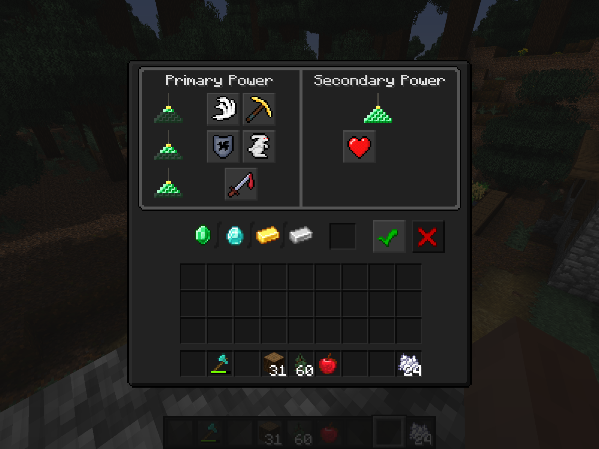
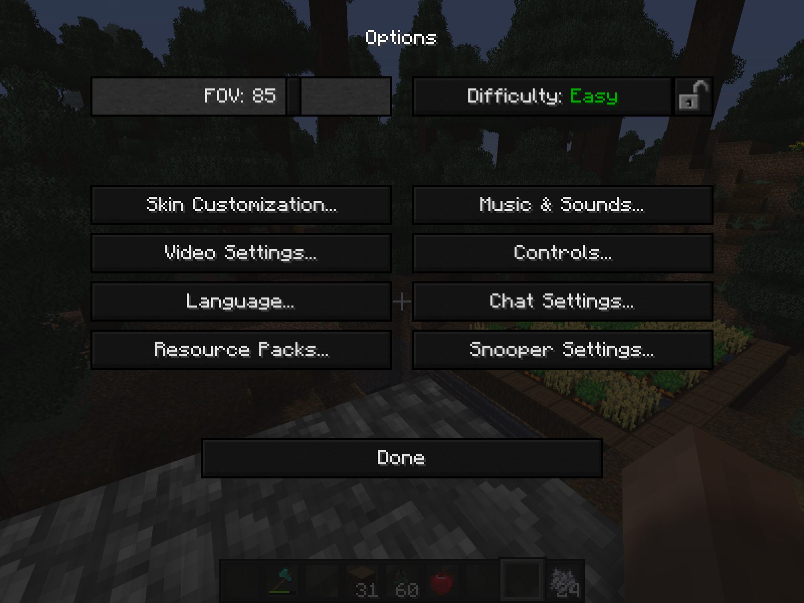

 

This Resourcepack changes only the HUD and some text colors of your game. This means you can still use it together with other Resourcepacks. There are quite a lot of Resourcepacks like this out there, but this one has no accent colors. I tried to get the same dark shades as the Windows dark theme. In addition to this I've added highlights to some texts (for Example colored difficult levels).
I have colored all language files with [this](https://github.com/Moggla/MC_Language_Formatter) generator.

# Screenshots
 
 
 
 
 
 
 
 
 

# Installation instructions
- Download the Resourcepack
- Start Minecraft (Java Edition)
- Click on Options...
- Click on Resource Packs...
- Click on Open Resource Pack Folder
- Place the .zip File in there

# Older Versions
For this resource pack to work for old versions, you have to rename some files at the moment.

Open the resource package and goto:
"Dark Theme\assets\minecraft\textures\gui\container"
Now change all ".old.png" to ".png"
If ask replace all existing files.

Unfortunately the recolor of the texts don't work in some old versions :/

# Credit
Login Background Map is from imbilio, Logo created with ewanhowell5195 Blockbench plugin
